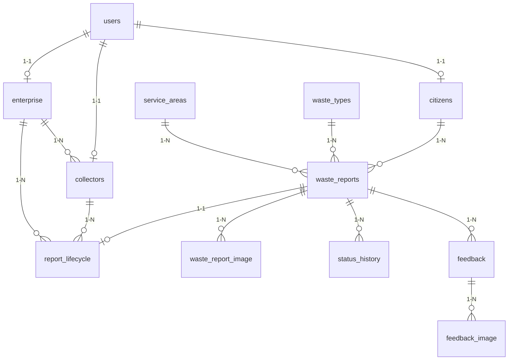

# Grevo Backend Material

Hệ thống backend cho ứng dụng quản lý rác thải và môi trường Grevo - một nền tảng kết nối công dân, doanh nghiệp thu gom và quản lý báo cáo rác thải.

## 📋 Tổng Quan

Grevo-BE-Material là một RESTful API được xây dựng bằng Spring Boot, cung cấp các chức năng quản lý người dùng, báo cáo rác thải, theo dõi thu gom và hệ thống điểm thưởng cho người dùng.

### Tính Năng Chính

- **Quản lý người dùng đa vai trò**: Hỗ trợ 4 vai trò - CITIZEN (Công dân), ENTERPRISE (Doanh nghiệp), COLLECTOR (Người thu gom), ADMIN (Quản trị viên)
- **Xác thực & Phân quyền**: JWT-based authentication với Spring Security, hỗ trợ đăng nhập Google OAuth2
- **Quản lý báo cáo rác thải**: Tạo, theo dõi và quản lý báo cáo rác thải từ công dân
- **Hệ thống điểm thưởng**: Tích điểm cho công dân dựa trên chất lượng báo cáo
- **Quản lý vòng đời báo cáo**: Theo dõi quá trình từ báo cáo đến thu gom hoàn tất
- **Upload ảnh**: Hỗ trợ upload avatar và ảnh báo cáo rác thải
- **Quản lý khu vực dịch vụ**: Phân chia và quản lý các khu vực thu gom

## 🛠️ Công Nghệ Sử Dụng

### Core Framework
- **Spring Boot 4.0.1** - Framework chính
- **Java 21** - Ngôn ngữ lập trình
- **Maven** - Build tool

### Dependencies
- **Spring Boot Web** - RESTful API
- **Spring Boot Security** - Bảo mật và phân quyền
- **Spring Boot Data JPA** - ORM và database access
- **Spring Boot Validation** - Validation dữ liệu
- **Spring Security OAuth2 Client** - Google OAuth2 integration

### Database
- **H2 Database** - Development (in-memory)
- **MySQL** - Production

### Authentication & Security
- **JWT (JJWT 0.12.5)** - JSON Web Token
- **Google OAuth2 Client Library** - Google Sign-In

### Utilities
- **Lombok** - Giảm boilerplate code
- **SpringDoc OpenAPI 2.3.0** - API documentation (Swagger)
- **Cloudinary** - Cloud storage cho ảnh (avatar, waste report images)

## 📁 Cấu Trúc Dự Án

```
grevo-be-material/
├── src/
│   ├── main/
│   │   ├── java/org/grevo/grevobematerial/
│   │   │   ├── config/              # Cấu hình ứng dụng
│   │   │   │   ├── SecurityConfig.java
│   │   │   │   └── WebConfig.java
│   │   │   ├── controller/          # REST Controllers
│   │   │   │   ├── AuthController.java
│   │   │   │   └── UserController.java
│   │   │   ├── dto/                 # Data Transfer Objects
│   │   │   │   ├── request/
│   │   │   │   │   ├── ChangePasswordRequest.java
│   │   │   │   │   ├── LoginRequest.java
│   │   │   │   │   ├── RegisterRequest.java
│   │   │   │   │   └── UpdateProfileRequest.java
│   │   │   │   └── response/
│   │   │   │       └── AuthResponse.java
│   │   │   ├── entity/              # JPA Entities (16 entities)
│   │   │   │   ├── Users.java
│   │   │   │   ├── Citizens.java
│   │   │   │   ├── Enterprise.java
│   │   │   │   ├── Collectors.java
│   │   │   │   ├── WasteReports.java
│   │   │   │   ├── WasteTypes.java
│   │   │   │   ├── ServiceAreas.java
│   │   │   │   ├── ReportLifecycle.java
│   │   │   │   ├── StatusHistory.java
│   │   │   │   ├── Feedback.java
│   │   │   │   ├── FeedbackImage.java
│   │   │   │   ├── WasteReportImage.java
│   │   │   │   ├── Notification.java
│   │   │   │   ├── PointRules.java
│   │   │   │   ├── Rewards.java
│   │   │   │   ├── EnterpriseArea.java
│   │   │   │   └── enums/
│   │   │   │       └── Role.java
│   │   │   ├── repository/          # JPA Repositories (16 repositories)
│   │   │   ├── security/            # Security components
│   │   │   │   ├── JwtFilter.java
│   │   │   │   └── JwtUtils.java
│   │   │   ├── service/             # Business logic
│   │   │   │   ├── UserService.java
│   │   │   │   ├── CustomUserDetailsService.java
│   │   │   │   └── impl/
│   │   │   │       ├── AuthService.java
│   │   │   │       └── UserServiceImpl.java
│   │   │   └── GrevoBeMaterialApplication.java
│   │   └── resources/
│   │       ├── application.properties
│   │       └── application-dev.properties
│   └── test/
├── uploads/                         # Thư mục lưu file upload
├── Dockerfile                       # Docker configuration
├── pom.xml                         # Maven dependencies
└── ERD_JSON.json                   # Database schema diagram
```

## 🗄️ Database Schema

### Các Bảng Chính

#### 1. **users** - Bảng người dùng
- `user_id` (PK)
- `google_id` - Google OAuth ID
- `username` - Tên đăng nhập (unique)
- `password` - Mật khẩu (hashed)
- `role` - Vai trò (CITIZEN, ENTERPRISE, COLLECTOR, ADMIN)
- `is_active` - Trạng thái hoạt động
- `is_verified` - Trạng thái xác thực
- `full_name`, `email`, `phone`, `address`
- `avatar` - URL ảnh đại diện
- `create_at`, `update_at`
- `rsPasswordToken`, `rsPasswordTExpiry` - Reset password

#### 2. **citizens** - Thông tin công dân
- `citizen_id` (PK)
- `user_id` (FK -> users)
- `total_points` - Tổng điểm tích lũy

#### 3. **enterprise** - Thông tin doanh nghiệp
- `enterprise_id` (PK)
- `user_id` (FK -> users)
- `company_name`, `company_phone`, `company_email`, `company_adr`
- `tax_code` - Mã số thuế
- `capacity` - Công suất xử lý

#### 4. **collectors** - Thông tin người thu gom
- `collector_id` (PK)
- `user_id` (FK -> users)
- `enterprise_id` (FK -> enterprise)
- `vehicle_type`, `vehicle_plate`
- `max_capacity` - Sức chứa tối đa
- `current_status` - Trạng thái hiện tại
- `last_active_at` - Lần hoạt động cuối

#### 5. **waste_reports** - Báo cáo rác thải
- `report_id` (PK)
- `citizen_id` (FK -> citizens)
- `waste_type_id` (FK -> waste_types)
- `area_id` (FK -> service_areas)
- `title`, `description`
- `latitude`, `longitude` - Vị trí GPS
- `status` - Trạng thái báo cáo
- `quality_score` - Điểm chất lượng
- `waste_quantity` - Khối lượng rác
- `created_at`

#### 6. **waste_types** - Loại rác thải
- `type_id` (PK)
- `name` - Tên loại rác
- `base_points` - Điểm cơ bản

#### 7. **service_areas** - Khu vực dịch vụ
- `area_id` (PK)
- `area_name`, `area_code`

#### 8. **report_lifecycle** - Vòng đời báo cáo
- `lifecycle_id` (PK)
- `report_id` (FK -> waste_reports)
- `collector_id` (FK -> collectors)
- `enterprise_id` (FK -> enterprise)
- `accepted_at`, `assigned_at`, `collected_at`

#### 9. **status_history** - Lịch sử trạng thái
- Theo dõi các thay đổi trạng thái của báo cáo

#### 10. **feedback** & **feedback_image** - Phản hồi và ảnh phản hồi

#### 11. **waste_report_image** - Ảnh báo cáo rác thải

#### 12. **notification** - Thông báo

#### 13. **point_rules** - Quy tắc tính điểm

#### 14. **rewards** - Phần thưởng

#### 15. **enterprise_area** - Khu vực phục vụ của doanh nghiệp

### Mối Quan Hệ



## 🔌 API Endpoints

### Authentication (`/api/auth`)

| Method | Endpoint | Mô tả | Auth Required |
|--------|----------|-------|---------------|
| POST | `/api/auth/register` | Đăng ký tài khoản mới | ❌ |
| POST | `/api/auth/login` | Đăng nhập | ❌ |
| POST | `/api/auth/google-login` | Đăng nhập Google | ❌ |
| POST | `/api/auth/logout` | Đăng xuất | ✅ |

**Request Examples:**

```json
// Register
POST /api/auth/register
{
  "username": "user123",
  "password": "password123",
  "email": "user@example.com",
  "fullName": "Nguyen Van A",
  "phone": "0123456789"
}

// Login
POST /api/auth/login
{
  "username": "user123",
  "password": "password123"
}

// Google Login
POST /api/auth/google-login
{
  "token": "google_id_token_here"
}
```

### User Management (`/api/users`)

| Method | Endpoint | Mô tả | Auth Required |
|--------|----------|-------|---------------|
| GET | `/api/users/profile` | Lấy thông tin profile | ✅ |
| PUT | `/api/users/profile` | Cập nhật profile | ✅ |
| PUT | `/api/users/password` | Đổi mật khẩu | ✅ |
| POST | `/api/users/avatar` | Upload avatar | ✅ |
| DELETE | `/api/users/avatar` | Xóa avatar | ✅ |
| DELETE | `/api/users/account` | Xóa tài khoản | ✅ |

**Request Examples:**

```json
// Update Profile
PUT /api/users/profile
{
  "fullName": "Nguyen Van B",
  "email": "newmail@example.com",
  "phone": "0987654321",
  "address": "123 Street, City"
}

// Change Password
PUT /api/users/password
{
  "currentPassword": "oldpassword",
  "newPassword": "newpassword"
}
```

## 🚀 Hướng Dẫn Cài Đặt và Chạy

### Yêu Cầu Hệ Thống

- Java 21 hoặc cao hơn
- Maven 3.9+
- MySQL 8.0+ (cho production)
- Docker (optional)

### Cài Đặt Local

1. **Clone repository**
```bash
git clone <repository-url>
cd grevo-be-material
```

2. **Cấu hình môi trường**

Tạo file `.env.dev` với các biến môi trường:
```properties
JWT_SECRET=your_jwt_secret_key_here
JWT_EXPIRATION=86400000
GOOGLE_CLIENT_ID=your_google_client_id
SPRING_PROFILES_ACTIVE=dev

# Cloudinary (for avatar upload)
CLOUDINARY_CLOUD_NAME=your_cloudinary_cloud_name
CLOUDINARY_API_KEY=your_cloudinary_api_key
CLOUDINARY_API_SECRET=your_cloudinary_api_secret
```

> **Lưu ý**: Để lấy Cloudinary credentials:
> 1. Đăng ký miễn phí tại https://cloudinary.com
> 2. Vào Dashboard để lấy Cloud Name, API Key và API Secret

3. **Chạy với Maven (Development mode - H2 Database)**
```bash
mvn spring-boot:run -Dspring-boot.run.profiles=dev
```

4. **Truy cập ứng dụng**
- API: `http://localhost:8080`
- H2 Console: `http://localhost:8080/h2-console`
  - JDBC URL: `jdbc:h2:mem:grevodb`
  - Username: `sa`
  - Password: (để trống)
- Swagger UI: `http://localhost:8080/swagger-ui.html`

### Chạy với Docker

1. **Build Docker image**
```bash
docker build -t grevo-be-material .
```

2. **Chạy container**
```bash
docker run -p 8080:8080 \
  -e SPRING_PROFILES_ACTIVE=dev \
  -e JWT_SECRET=your_secret \
  -e JWT_EXPIRATION=86400000 \
  -e GOOGLE_CLIENT_ID=your_client_id \
  -e CLOUDINARY_CLOUD_NAME=your_cloud_name \
  -e CLOUDINARY_API_KEY=your_api_key \
  -e CLOUDINARY_API_SECRET=your_api_secret \
  grevo-be-material
```

### Cấu Hình Production (MySQL)

1. **Tạo file `.env.prod`** với các biến môi trường production

2. **Tạo file `application-prod.properties`**
```properties
spring.datasource.url=jdbc:mysql://localhost:3306/grevodb
spring.datasource.username=your_mysql_username
spring.datasource.password=your_mysql_password
spring.jpa.hibernate.ddl-auto=update
spring.jpa.database-platform=org.hibernate.dialect.MySQLDialect
jwt.secret=${JWT_SECRET}
```

3. **Chạy với profile production**
```bash
mvn spring-boot:run -Dspring-boot.run.profiles=prod
```

## 🔐 Bảo Mật

### JWT Authentication

- Token được tạo khi đăng nhập thành công
- Token có thời gian hết hạn (mặc định 24h)
- Gửi token trong header: `Authorization: Bearer <token>`

### Google OAuth2

- Hỗ trợ đăng nhập bằng tài khoản Google
- Tự động tạo tài khoản nếu chưa tồn tại
- Lưu Google ID để liên kết tài khoản

### Password Security

- Mật khẩu được hash bằng BCrypt
- Hỗ trợ reset password với token có thời hạn

## 📝 Logging

- Development: DEBUG level cho Spring Security và application
- Production: Tắt SQL logging, chỉ log ERROR và WARN

## 🧪 Testing

```bash
# Chạy tests
mvn test

# Chạy tests với coverage
mvn test jacoco:report
```

## 📦 Build Production

```bash
# Build JAR file
mvn clean package -DskipTests

# JAR file sẽ được tạo tại: target/grevo-be-material-0.0.1-SNAPSHOT.jar

# Chạy JAR file
java -jar target/grevo-be-material-0.0.1-SNAPSHOT.jar
```

## 🐛 Troubleshooting

### Lỗi kết nối database
- Kiểm tra MySQL service đang chạy
- Xác nhận thông tin kết nối trong `application-prod.properties`

### Lỗi JWT
- Kiểm tra biến môi trường `JWT_SECRET` đã được set
- Đảm bảo token chưa hết hạn

### Lỗi Google OAuth
- Xác nhận `GOOGLE_CLIENT_ID` đúng
- Kiểm tra token từ frontend hợp lệ

### Avatar không hiển thị sau khi upload (trên Render/Cloud)
- **Nguyên nhân**: Render và các platform tương tự sử dụng ephemeral filesystem - file upload sẽ bị xóa khi container restart
- **Giải pháp**: Đã tích hợp Cloudinary cloud storage
- **Kiểm tra**:
  - Đảm bảo đã set 3 environment variables: `CLOUDINARY_CLOUD_NAME`, `CLOUDINARY_API_KEY`, `CLOUDINARY_API_SECRET`
  - URL avatar phải có dạng `https://res.cloudinary.com/...` (không phải `http://localhost/uploads/...`)
  - Kiểm tra logs để xem có lỗi upload lên Cloudinary không

## 📄 License

[Thêm thông tin license của bạn]

## 👥 Contributors

[Thêm thông tin về team phát triển]

## 📞 Liên Hệ

[Thêm thông tin liên hệ]

---

**Phiên bản:** 0.0.1-SNAPSHOT  
**Cập nhật lần cuối:** 2026-01-13
